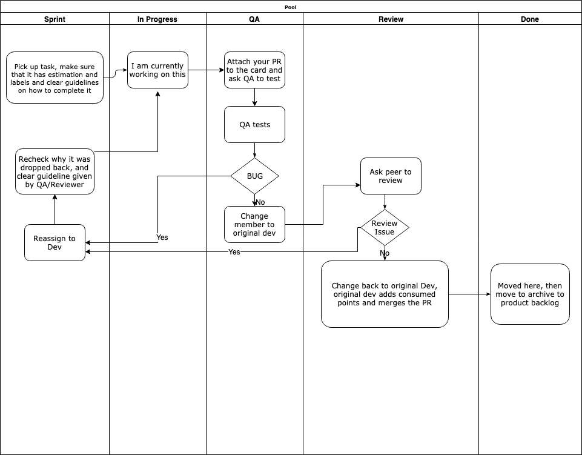

# Operational Process - traceto.io Dev
## Working Flow

We are following git flow, additional information about git flow can be read at the following 
[cheatsheet](https://danielkummer.github.io/git-flow-cheatsheet/). 

Our general flow is represented by:



- Add an epic from the roadmap to the product backlog;
- Add user stories for the epic;
- Plan sprint with these epic and tasks from backlog;
- Once sprint starts follow the diagram on how to move tasks across the trello board;
- Our current sprint board is [here](https://trello.com/b/rWIyiu62/tracetoio-dapp);
- Every Merge to develop requires at least 1 approval. That means 1 peer review;

#### Locally - Developer

```
git fetch
git checkout develop
git pull origin develop
git flow feature start <Trello Card Id>-<Brief Header of Task>

git flow feature finish <Trello Card Id>-<Brief Header of Task>

```

#### Additional Steps
1. Run Linter
2. Follow [style guide](https://github.com/tracetoio/styleguide)  while developing 
3. If there are unit tests, run locally before pushing to QA. (Make sure that your code compiles)


## Release Flow

### UAT 
Once in UAT, respective leads, to see what are bugs and what are not and condense to a single card. 
Subsequently, move this card to the Sprint Board as a Bugfix card. 

We try to release at the end of every sprint.
As a practice we try to release to UAT on Monday/Tuesday and do a production release by Thursday

#### Bugfixes
For Git Flow, when there is a bugfix card, pull from the latest release branch and create a new bugfix branch. 
Solve and PR back to release branch

Once all bugfixes are cleared, add a release tag with rc-v<> and then push the tag which would move the changes to beta environment.

```
git fetch
git checkout release/v[MAJOR].[MINOR].[PATCH]
git flow bugfix start <Trello Card Id>-<Brief Header of Task>
git flow bugfix finish <Trello Card Id>-<Brief Header of Task>
```

Once production ready, we will use tag like v1.0.1 and this will push to production.

## Hotfixes - Production Bugs

For hotfix do the following 

```
 git pull master and develop branches
 git flow hotfix start v1.0.1 for eg. (use regular version numbers) 
 git flow hotfix publish( in case other people have to contribute to this hotfix or peer review)
 git flow hotfix finish
 git push – all
 git push –tags
 
```
## Deployment
- The tags/branches once pushed, in jenkins/codedeploy it auto deploys to the environment;
- Please note for frontend and backend that for production releases there is a manual check currently;
- We will be removing this soon as well;

## References
1. https://github.com/petervanderdoes/gitflow-avh
2. https://danielkummer.github.io/git-flow-cheatsheet/
